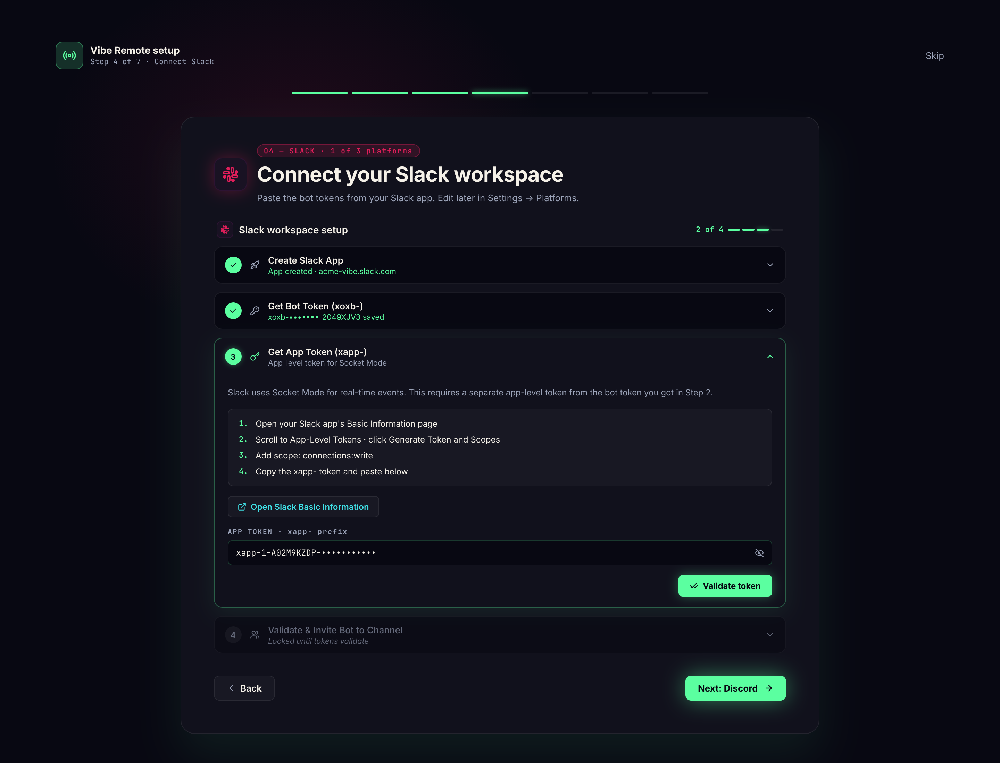
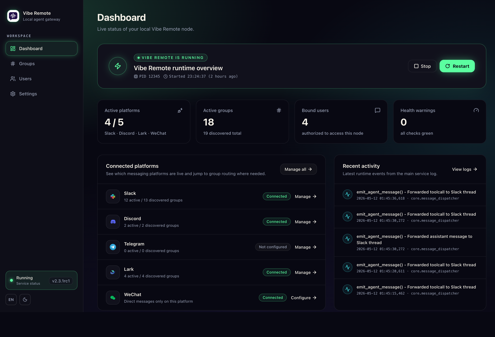
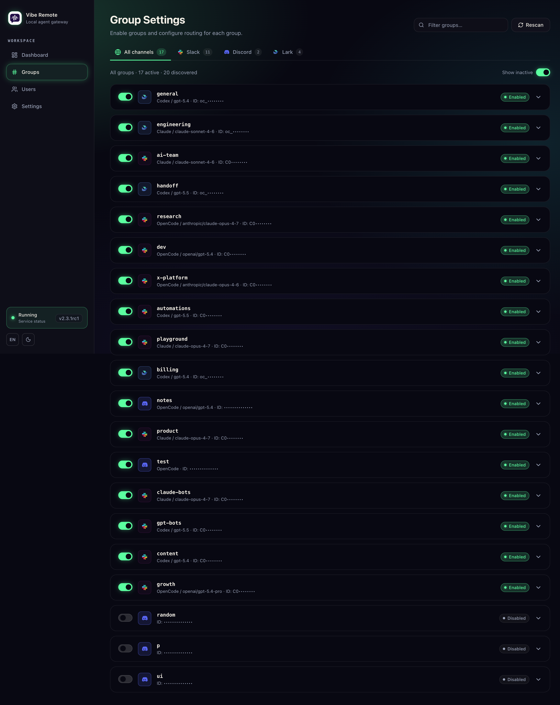
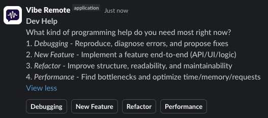

<div align="center">


# Vibe Remote

### Your AI agent army, commanded from Slack, Discord, WeChat & Lark.

**No laptop. No IDE. Just vibes.**

[](https://github.com/cyhhao/vibe-remote/stargazers)
[](https://www.python.org/)
[](LICENSE)

[English](README.md) | [中文](README_ZH.md)

**Supported Platforms**


**Supported Agents**


---


</div>

## The Pitch

You're at the beach. Phone buzzes — production's on fire.

**Old you:** Panic. Find WiFi. Open laptop. Wait for IDE. Lose your tan.

**Vibe Remote you:** Open Slack, Discord, or WeChat. Type "Fix the auth bug in login.py". Watch Claude Code fix it in real-time. Approve. Sip margarita.

```
AI works. You live.
```

---

## Install in 10 Seconds

```bash
curl -fsSL https://raw.githubusercontent.com/cyhhao/vibe-remote/master/install.sh | bash && vibe
```

That's it. Browser opens -> Follow the wizard -> Done.

<details>
<summary><b>Windows?</b></summary>

```powershell
irm https://raw.githubusercontent.com/cyhhao/vibe-remote/master/install.ps1 | iex
```
</details>

---

## Why This Exists

| Problem | Solution |
|---------|----------|
| Claude Code is amazing but needs a terminal | Slack/Discord/WeChat/Lark IS your terminal now |
| Context-switching kills flow | Stay in one app |
| Can't code from phone | Yes you can |
| Multiple agents, multiple setups | One chat app, any agent |

**Supported Agents:**
- [Claude Code](https://docs.anthropic.com/en/docs/claude-code) — Deep reasoning, complex refactors
- [OpenCode](https://opencode.ai) — Fast, extensible, community favorite  
- [Codex](https://github.com/openai/codex) — OpenAI's coding model

---

## Why Vibe Remote over OpenClaw?

| | Vibe Remote | OpenClaw |
|---|---|---|
| **Setup** | One command + web wizard. Done in 2 minutes. | Gateway + channels + JSON config. Expect an afternoon. |
| **Security** | Local-first. Socket Mode / WebSocket only. No public endpoints, no inbound ports, minimal attack surface. | Gateway exposes ports. More moving parts, more attack surface. |
| **Token cost** | Thin transport layer — relays messages between your IM and agent. Zero LLM overhead from the middleware itself. | Every message carries a long system context for maintaining agent persona, IM tooling, and orchestration plumbing. Tokens burn on overhead before your actual task even starts. |

OpenClaw is a personal AI assistant — great for casual chat, but its always-on agent loop makes it expensive for real productivity workloads. Vibe Remote is not an agent framework. It's a **remote control** — a minimal bridge between your chat app and whatever AI agent you already use. It adds no extra intelligence layer, no extra token spend, and no extra attack surface. Every token goes straight to your task.

---

## Highlights

<table>
<tr>
<td width="33%">

### Setup Wizard

One-command install, guided configuration. No manual token juggling.



</td>
<td width="33%">

### Dashboard

Real-time status, health monitoring, and quick controls.



</td>
<td width="33%">

### Channel Routing

Per-channel agent configuration. Different projects, different agents.



</td>
</tr>
</table>

### Instant Notifications

Get notified the moment your AI finishes. Like assigning tasks to employees — delegate, go do something else, and come back when the work is done. No need to babysit.

### Thread = Session

Each Slack/Discord/WeChat/Lark thread is an isolated workspace. Open 5 threads, run 5 parallel tasks. Context stays separate.

### Interactive Prompts

When your agent needs input — file selection, confirmation, options — your chat app pops up buttons or a modal. Full CLI interactivity, zero terminal required.



---

## How It Works

```
┌──────────────┐             ┌──────────────┐             ┌──────────────┐
│     You      │   Slack     │              │   stdio     │  Claude Code │
│  (anywhere)  │   Discord   │ Vibe Remote  │ ──────────▶ │  OpenCode    │
│              │   WeChat    │  (your Mac)  │ ◀────────── │  Codex       │
│              │   Lark      │              │             │              │
└──────────────┘             └──────────────┘             └──────────────┘
```

1. **You type** in Slack/Discord/WeChat/Lark: *"Add dark mode to the settings page"*
2. **Vibe Remote** routes to your configured agent
3. **Agent** reads your codebase, writes code, streams back
4. **You review** in your chat app, iterate in thread

**Your code never leaves your machine.** Vibe Remote runs locally and connects via Slack Socket Mode, Discord Gateway, WeChat polling, or Lark WebSocket.

---

## Commands

| In chat | What it does |
|----------|--------------|
| `@Vibe Remote /start` | Open control panel |
| `/stop` | Kill current session |
| Just type | Talk to your agent |
| Reply in thread | Continue conversation |

**Pro tip:** Each thread = isolated session. Start multiple threads for parallel tasks.

---

## Instant Agent Switching

Need a different agent mid-conversation? Just prefix your message:

```
Plan: Design a new caching layer for the API
```

That's it. No menus, no commands. Type `AgentName:` and your message routes to that agent instantly.

---

## Per-Channel Routing

Different projects, different agents:

```
#frontend    → OpenCode (fast iteration)
#backend     → Claude Code (complex logic)  
#prototypes  → Codex (quick experiments)
```

Configure in web UI → Channels.

---

## CLI

```bash
vibe          # Start everything
vibe status   # Check if running
vibe stop     # Stop everything
vibe doctor   # Diagnose issues
```

---

## Prerequisites

You need at least one coding agent installed:

<details>
<summary><b>OpenCode</b> (Recommended)</summary>

```bash
curl -fsSL https://opencode.ai/install | bash
```

**Required:** Add to `~/.config/opencode/opencode.json` to skip permission prompts:

```json
{
  "permission": "allow"
}
```
</details>

<details>
<summary><b>Claude Code</b></summary>

```bash
npm install -g @anthropic-ai/claude-code
```
</details>

<details>
<summary><b>Codex</b></summary>

```bash
npm install -g @openai/codex
```
</details>

---

## Security

- **Local-first** — Vibe Remote runs on your machine
- **Socket Mode / WebSocket** — No public URLs, no webhooks
- **Your tokens** — Stored in `~/.vibe_remote/`, never uploaded
- **Your code** — Stays on your disk, sent only to your chosen AI provider

---

## Uninstall

```bash
vibe stop && uv tool uninstall vibe-remote && rm -rf ~/.vibe_remote
```

---

## Roadmap

- [x] Slack support
- [x] Discord support
- [x] WeChat support
- [x] Lark (Feishu) support
- [x] Web UI setup wizard & dashboard
- [x] Per-channel agent routing
- [x] Interactive prompts (buttons, modals)
- [x] File attachments
- [ ] SaaS Mode
- [ ] Vibe Remote Coding Agent (one agent to rule them all)
- [ ] Skills Manager
- [ ] Best practices & multi-workspace guide

---

## Docs

- **[CLI Reference](docs/CLI.md)** — Command-line usage and service lifecycle
- **[Slack Setup Guide](docs/SLACK_SETUP.md)** — Detailed setup with screenshots
- **[Discord Setup Guide](docs/DISCORD_SETUP.md)** — Detailed setup with screenshots
- **WeChat Setup Guide** — Follow the in-app wizard (`vibe` → choose WeChat)
- **Lark Setup Guide** — Follow the in-app wizard (`vibe` → choose Lark)

## Remote Server Tip (SSH)

If you run Vibe Remote on a remote server, keep the Web UI bound to `127.0.0.1:5123` and access it via SSH port forwarding:

```bash
ssh -NL 5123:localhost:5123 user@server-ip
```

See: **[CLI Reference](docs/CLI.md)** (search for "Remote Web UI Access")

---

<div align="center">

**Stop context-switching. Start vibe coding.**

[Install Now](#install-in-10-seconds) · [Setup Guide](docs/SLACK_SETUP.md) · [Report Bug](https://github.com/cyhhao/vibe-remote/issues) · [Follow @alex_metacraft](https://x.com/alex_metacraft)

---

*Built for developers who code from anywhere.*

</div>
