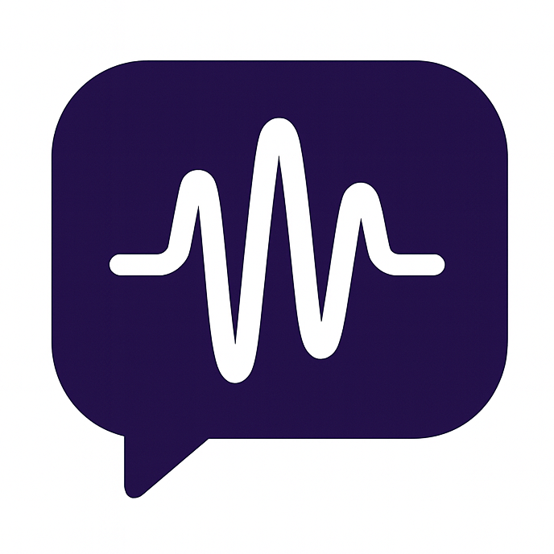

<div align="center">



# Vibe Remote

### 躺在沙发上写代码，在海边发布上线

**在 Slack 里操控 AI 编码代理 — 不需要 IDE**

[](https://www.python.org/)
[](LICENSE)
[](CONTRIBUTING.md)

[English](README.md) | [中文](README_ZH.md)

---


</div>

## 为什么用 Vibe Remote？

你在度假。手机响了 — 生产环境出 bug 了。

有了 Vibe Remote，你不用手忙脚乱找电脑。打开 Slack，打几个字说明要修什么，然后看着 AI 实时把解决方案写出来。审查、确认、搞定。继续喝你的玛格丽塔。

**这就是 vibe coding。**

- 🛋️ **随时随地工作** — Slack 就是你的 IDE
- 🤖 **多 Agent 支持** — OpenCode、Claude Code、Codex — 按频道切换
- 🧵 **基于线程的会话** — 每个对话独立，可恢复
- ⚡ **实时流式输出** — 看着 AI 思考和写代码
- 🔒 **本地优先** — 代码不离开你的电脑

---

## 30 秒安装

**macOS / Linux:**
```bash
curl -fsSL https://raw.githubusercontent.com/cyhhao/vibe-remote/master/install.sh | bash
```

**Windows:**
```powershell
irm https://raw.githubusercontent.com/cyhhao/vibe-remote/master/install.ps1 | iex
```

然后运行：
```bash
vibe
```

Web 界面会自动打开。添加你的 Slack token。启用频道。开始 vibe。

---

## 工作原理

```
┌─────────────┐     ┌─────────────┐     ┌─────────────┐
│    Slack    │────▶│ Vibe Remote │────▶│  AI Agent   │
│  (你输入)    │     │   (路由)     │     │   (写代码)   │
└─────────────┘     └─────────────┘     └─────────────┘
                           │
                           ▼
                    ┌─────────────┐
                    │   你的本地   │
                    │    代码库    │
                    └─────────────┘
```

1. **你**在 Slack 输入：*"修复 auth.py 里的登录 bug"*
2. **Vibe Remote** 路由到你选的 AI（OpenCode/Claude/Codex）
3. **Agent** 分析、写代码、实时返回结果
4. **你**在 Slack 里审查，继续对话迭代

所有执行都在本地。代码不会离开你的机器。

---

## 快捷命令

| 命令 | 作用 |
|---------|--------------|
| `/start` | 打开主菜单 |
| `/stop` | 停止当前 Agent 会话 |
| `/cwd` | 显示工作目录 |
| `/settings` | 配置消息显示 |

**技巧：** 用线程！每个线程都有独立的会话和工作目录。

---

## 按频道路由 Agent

不同项目需要不同的 Agent。按频道配置：

| 频道 | Agent | 原因 |
|---------|-------|-----|
| `#frontend` | OpenCode | 快，适合 UI 开发 |
| `#backend` | Claude Code | 深度推理，适合复杂逻辑 |
| `#experiments` | Codex | 快速原型 |

在 Web UI 配置：`http://localhost:5173/channels`

---

## 前置条件

你需要至少安装一个编码 Agent CLI：

<details>
<summary><b>OpenCode</b>（推荐）</summary>

```bash
brew install opencode
# 或
curl -fsSL https://opencode.ai/install | bash
```
</details>

<details>
<summary><b>Claude Code</b></summary>

```bash
npm install -g @anthropic-ai/claude-code
```
</details>

<details>
<summary><b>Codex</b></summary>

```bash
brew install codex
```
</details>

---

## CLI 参考

```bash
vibe          # 启动服务 + 打开 Web UI
vibe status   # 检查服务状态
vibe stop     # 停止所有服务
vibe doctor   # 诊断问题
```

---

## 卸载

```bash
vibe stop
uv tool uninstall vibe-remote   # 或: pip uninstall vibe-remote
rm -rf ~/.vibe_remote           # 删除配置（可选）
```

---

## 文档

- **[Slack 安装指南](docs/SLACK_SETUP_ZH.md)** — 5 分钟创建你的 Slack App
- **[English Setup Guide](docs/SLACK_SETUP.md)** — English setup guide

---

## 安全

- 🔐 Token 本地存储在 `~/.vibe_remote/config/config.json`
- 🏠 Web UI 只在 localhost 运行
- 💻 所有代码执行都在你的机器上
- 🚫 不向第三方发送数据（除了你选择的 AI 提供商）

---

## 路线图

- [ ] 更多 IM 平台（Discord、Teams）
- [ ] 文件附件支持
- [ ] 多工作区 Slack 支持
- [ ] SaaS 模式 + 云中继

---

## 贡献

欢迎 PR！查看 [CONTRIBUTING.md](CONTRIBUTING.md)。

---

<div align="center">

**停止上下文切换。开始 vibe coding。**

[立即安装](#30-秒安装) · [设置 Slack](docs/SLACK_SETUP_ZH.md) · [报告 Bug](https://github.com/cyhhao/vibe-remote/issues)

</div>
