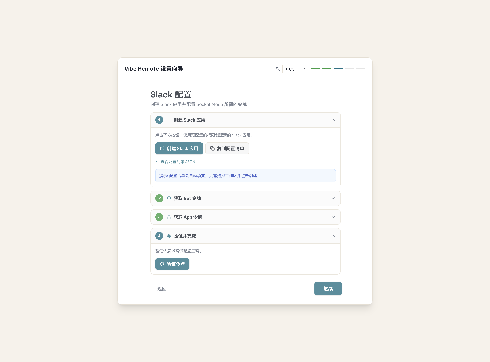
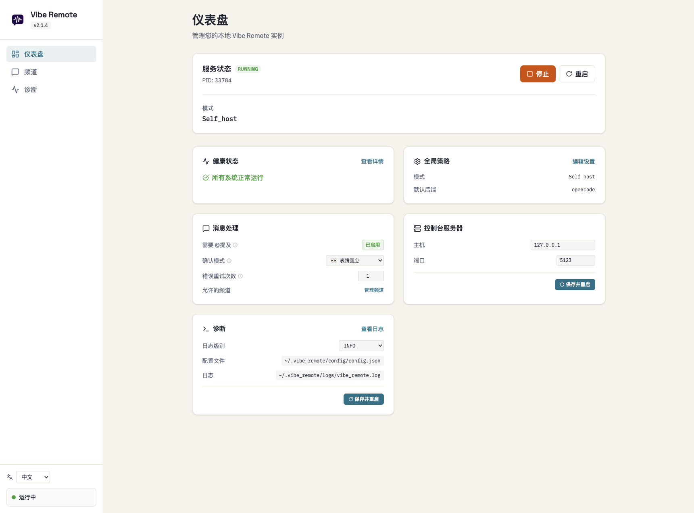
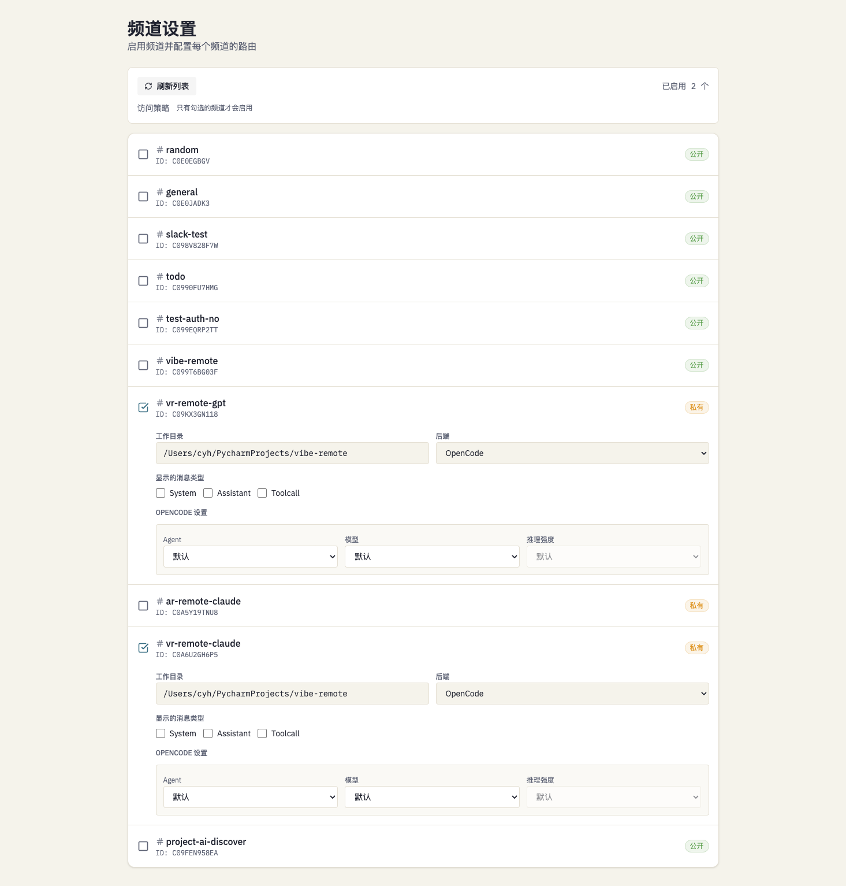
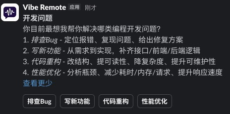

<div align="center">


# Vibe Remote

### 你的 AI 编码军团，用 Slack 指挥。

**不用笔记本电脑。不用 IDE。只需 vibe。**

[](https://github.com/cyhhao/vibe-remote/stargazers)
[](https://www.python.org/)
[](LICENSE)

[English](README.md) | [中文](README_ZH.md)

---


</div>

## 为什么

你在海边。手机响了 — 线上炸了。

**以前的你：** 慌了。找 WiFi。开电脑。等 IDE 加载。晒伤了。

**用了 Vibe Remote：** 打开 Slack。输入「修一下 login.py 的认证 bug」。看着 Claude Code 实时修复。批准。继续喝玛格丽塔。

```
让 AI 去忙，你去浪。
```

---

## 10 秒安装

```bash
curl -fsSL https://raw.githubusercontent.com/cyhhao/vibe-remote/master/install.sh | bash && vibe
```

完事。浏览器打开 -> 跟着向导走 -> 搞定。

<details>
<summary><b>Windows？</b></summary>

```powershell
irm https://raw.githubusercontent.com/cyhhao/vibe-remote/master/install.ps1 | iex
```
</details>

---

## 为什么要用

| 问题 | 解决 |
|------|------|
| Claude Code 很强但需要终端 | Slack 就是你的终端 |
| 上下文切换太累 | 一个 App 搞定 |
| 手机上写不了代码 | 现在可以了 |
| 多个 Agent，多套配置 | 一个 Slack，任意 Agent |

**支持的 Agent：**
- [Claude Code](https://docs.anthropic.com/en/docs/claude-code) — 深度推理，复杂重构
- [OpenCode](https://opencode.ai) — 快速，可扩展，社区最爱
- [Codex](https://github.com/openai/codex) — OpenAI 的编码模型

---

## 亮点

<table>
<tr>
<td width="33%">

### 设置向导

一行命令安装，引导式配置。不用手动折腾 token。



</td>
<td width="33%">

### 仪表盘

实时状态，健康监控，快捷控制。



</td>
<td width="33%">

### 频道路由

按频道配置 Agent。不同项目，不同 Agent。



</td>
</tr>
</table>

### 随时随地接收通知

AI 完成任务的那一刻，你就能收到通知。就像老板给员工布置任务一样 — 分配下去，去忙别的，完成了自然会通知你。不用盯着屏幕等。

### Thread = 会话

每个 Slack 线程是独立工作区。开 5 个线程，跑 5 个并行任务。上下文互不干扰。

### 交互式提示

Agent 需要输入时 — 文件选择、确认、选项 — Slack 弹出按钮或模态框。完整 CLI 交互，零终端。



---

## 工作原理

```
┌──────────────┐         ┌──────────────┐         ┌──────────────┐
│     你       │  Slack  │ Vibe Remote  │  stdio  │  AI Agent    │
│  (任何地方)  │ ──────▶ │  (你的 Mac)  │ ──────▶ │  (你的代码)  │
└──────────────┘         └──────────────┘         └──────────────┘
```

1. **你在 Slack 输入**：*"给设置页加个深色模式"*
2. **Vibe Remote** 路由到配置的 Agent
3. **Agent** 读取代码库，写代码，流式返回
4. **你在 Slack 审查**，在线程里迭代

**你的代码永远不离开你的机器。** Vibe Remote 本地运行，通过 Slack Socket Mode 连接。

---

## 命令

| Slack 里 | 干嘛的 |
|----------|--------|
| `@Vibe Remote /start` | 打开控制面板 |
| `/stop` | 停止当前会话 |
| 直接打字 | 跟 Agent 对话 |
| 在线程里回复 | 继续对话 |

**技巧：** 每个 Slack 线程 = 独立会话。开多个线程可以并行任务。

---

## 即时切换 Agent

对话中途想换个 Agent？加个前缀就行：

```
Plan: 设计一个新的 API 缓存层
```

就这样。不用菜单，不用命令。输入 `AgentName:` 消息就自动路由到对应 Agent。

---

## 按频道路由

不同项目，不同 Agent：

```
#frontend    → OpenCode（快速迭代）
#backend     → Claude Code（复杂逻辑）
#prototypes  → Codex（快速实验）
```

在 Web UI → Channels 配置。

---

## CLI

```bash
vibe          # 启动一切
vibe status   # 检查运行状态
vibe stop     # 停止一切
vibe doctor   # 诊断问题
```

---

## 前置条件

你需要至少安装一个编码 Agent：

<details>
<summary><b>OpenCode</b>（推荐）</summary>

```bash
curl -fsSL https://opencode.ai/install | bash
```
</details>

<details>
<summary><b>Claude Code</b></summary>

```bash
npm install -g @anthropic-ai/claude-code
```
</details>

<details>
<summary><b>Codex</b></summary>

```bash
npm install -g @openai/codex
```
</details>

---

## 安全

- **本地优先** — Vibe Remote 跑在你机器上
- **Socket Mode** — 没有公开 URL，没有 webhook
- **你的 token** — 存在 `~/.vibe_remote/`，永不上传
- **你的代码** — 留在你硬盘，只发给你选的 AI 提供商

---

## 卸载

```bash
vibe stop && uv tool uninstall vibe-remote && rm -rf ~/.vibe_remote
```

---

## 路线图

- [ ] SaaS Mode
- [ ] Vibe Remote Coding Agent（一个 Agent 统领全局）
- [ ] Slack 文件附件
- [ ] 多工作区

---

## 文档

- **[CLI 参考手册](docs/CLI_ZH.md)** — 命令行使用和服务生命周期
- **[Slack 配置指南](docs/SLACK_SETUP_ZH.md)** — 详细配置和截图

## 远端服务器提示（SSH）

如果你把 Vibe Remote 部署在远端服务器上，请保持 Web UI 只监听在 `127.0.0.1:5123`，并通过 SSH 端口转发在本机访问：

```bash
ssh -NL 5123:localhost:5123 user@server-ip
```

详见：**[CLI 参考手册](docs/CLI_ZH.md)**（搜索“远端服务器访问 Web UI”）

---

<div align="center">

**停止上下文切换。开始 vibe coding。**

[立即安装](#10-秒安装) · [配置指南](docs/SLACK_SETUP_ZH.md) · [报告 Bug](https://github.com/cyhhao/vibe-remote/issues)

---

*为随时随地写代码的开发者而建。*

</div>
