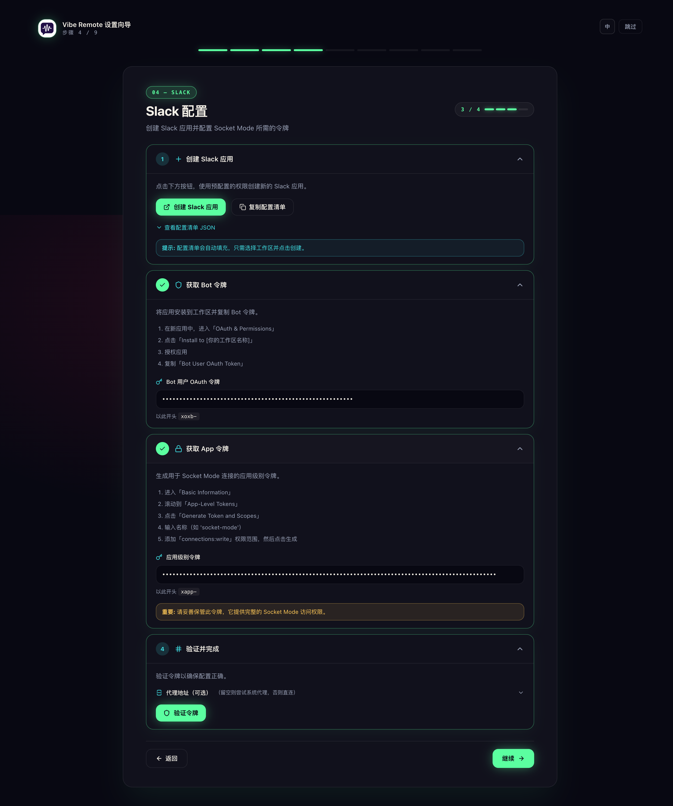
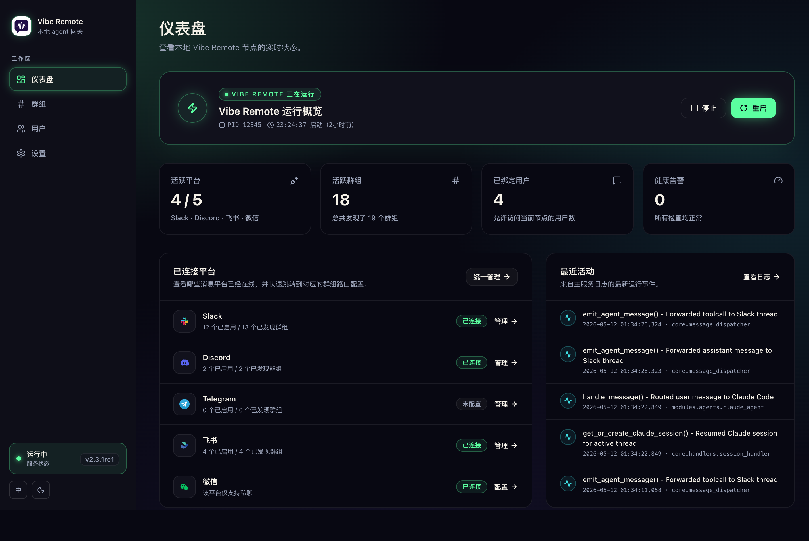
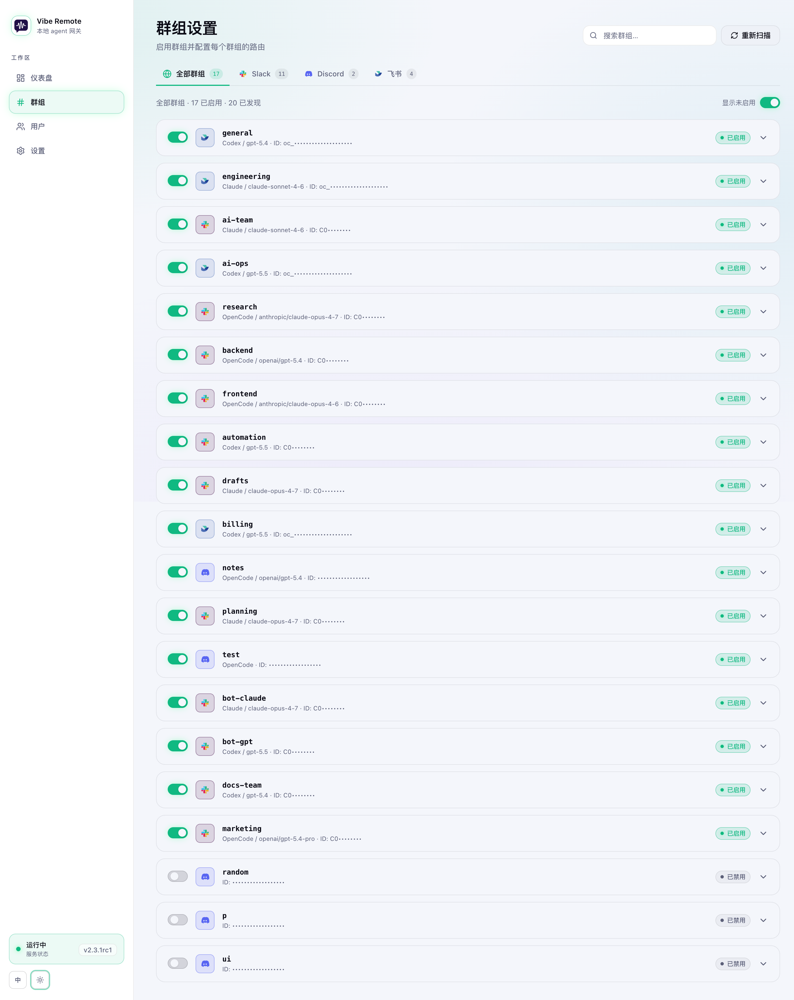
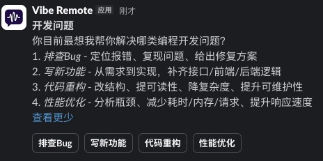

<div align="center">


# Vibe Remote

### 你的 AI agent 军团，用 Slack、Discord、Telegram、微信或飞书指挥。

**不用笔记本电脑。不用 IDE。只需 vibe。**

[](https://github.com/cyhhao/vibe-remote/stargazers)
[](https://www.python.org/)
[](LICENSE)

<a href="https://www.producthunt.com/products/vibe-remote?embed=true&utm_source=badge-featured&utm_medium=badge&utm_campaign=badge-vibe-remote" target="_blank" rel="noopener noreferrer"></a>

[English](README.md) | [中文](README_ZH.md)

**支持的平台**


**支持的 Agent**


![Codex](https://img.shields.io/badge/Codex-412991?style=flat-square&logo=)

---


</div>

## 为什么

你在海边。手机响了 — 线上炸了。

**以前的你：** 慌了。找 WiFi。开电脑。等 IDE 加载。晒伤了。

**用了 Vibe Remote：** 打开 Slack、Discord、Telegram 或微信。输入「修一下 login.py 的认证 bug」。看着 Claude Code 实时修复。批准。继续喝玛格丽塔。

```
让 AI 去忙，你去浪。
```

---

## 10 秒安装

```bash
curl -fsSL https://raw.githubusercontent.com/cyhhao/vibe-remote/master/install.sh | bash && vibe
```

完事。浏览器打开 -> 跟着向导走 -> 搞定。

如果你希望从另一台设备或远端服务器打开 Web UI，运行：

```bash
vibe remote
```

<details>
<summary><b>Windows？</b></summary>

Windows 下默认推荐使用 WSL 方案，因为它的兼容性最好。

- 推荐阅读：[Windows 用户：从零开始用 WSL 运行 Vibe Remote](docs/WINDOWS_WSL_ZH.md)

如果你完全没用过 WSL，这篇文档会讲清楚：
- 去哪里安装 WSL
- 应该打开哪个终端窗口
- 在哪里执行 Vibe Remote 的安装命令
- 如何启动 Ubuntu 并打开 Web UI
</details>

---

## 为什么要用

| 问题 | 解决 |
|------|------|
| Claude Code 很强但需要终端 | Slack/Discord/Telegram/微信/飞书就是你的终端 |
| 上下文切换太累 | 一个 App 搞定 |
| 电脑上开工，手机上接着做 | 直接恢复当前项目里的真实 Agent 会话 |
| 手机上写不了代码 | 现在可以了 |
| 多个 Agent，多套配置 | 一个聊天 App，任意 Agent |

**支持的 Agent：**
- [Claude Code](https://docs.anthropic.com/en/docs/claude-code) — 深度推理，复杂重构
- [OpenCode](https://opencode.ai) — 快速，可扩展，社区最爱
- [Codex](https://github.com/openai/codex) — OpenAI 的编码模型

---

## 为什么选 Vibe Remote 而不是 OpenClaw？

| | Vibe Remote | OpenClaw |
|---|---|---|
| **上手** | 一行命令 + Web 向导，2 分钟搞定。 | Gateway + channels + JSON 配置，准备花一下午。 |
| **安全** | 本地运行，仅 Socket Mode / WebSocket 出站连接。无公开端口，无入站流量，攻击面极小。 | Gateway 暴露端口，组件多，攻击面大。 |
| **Token 成本** | 薄传输层 — 只在 IM 和 Agent 之间转发消息，中间件本身零 LLM 开销。 | 每条消息都带着长长的系统上下文：维持助手人格、IM 工具调用、编排管线等。你的任务还没开始，token 已经在烧了。 |

OpenClaw 是个人 AI 助手 — 闲聊很好用，但它始终运转的 agent 循环让真正的生产力场景成本很高。Vibe Remote 不是 agent 框架，而是一个**遥控器** — 聊天 App 和 AI agent 之间的极简桥梁。不加额外智能层，不加额外 token 开销，不加额外攻击面。每一个 token 都直接花在你的任务上。

---

## 亮点

<table>
<tr>
<td width="33%">

### 设置向导

一行命令安装，引导式配置。不用手动折腾 token。



</td>
<td width="33%">

### 仪表盘

实时状态，健康监控，快捷控制。



</td>
<td width="33%">

### 频道路由

按频道配置 Agent。不同项目，不同 Agent。



</td>
</tr>
</table>

### 随时随地接收通知

AI 完成任务的那一刻，你就能收到通知。就像老板给员工布置任务一样 — 分配下去，去忙别的，完成了自然会通知你。不用盯着屏幕等。

### Thread = 会话

每个 Slack/Discord/Telegram/微信/飞书会话作用域都是独立工作区。开 5 个会话，跑 5 个并行任务。上下文互不干扰。

### 随时续上会话

电脑一合上，人已经在路上，任务还得继续。

Vibe Remote 可以直接列出当前工作目录下 Claude Code、OpenCode、Codex 的真实历史会话。选中最近那条，立刻从电脑切到手机继续干，不用重新解释背景，不用翻旧 thread，也不用担心上下文断掉。

### 交互式提示

Agent 需要输入时 — 文件选择、确认、选项 — 聊天 App 弹出按钮或模态框。完整 CLI 交互，零终端。



### 定时任务与异步 Hook

你可以让 Agent 把工作安排到稍后执行、按 cron 周期性触发，或者在长任务结束后异步补发一条消息。

- 用 `vibe task` 保存周期性或一次性提示
- 用 `vibe hook send` 队列化一次性的异步发送
- 需要时可把会话上下文和消息投递目标拆开

---

## 工作原理

```
┌──────────────┐             ┌──────────────┐             ┌──────────────┐
│     你       │   Slack     │              │   stdio     │  Claude Code │
│  (任何地方)  │   Discord   │ Vibe Remote  │ ──────────▶ │  OpenCode    │
│              │   Telegram  │  (你的 Mac)  │ ◀────────── │  Codex       │
│              │   微信      │              │             │              │
│              │   飞书      │              │             │              │
└──────────────┘             └──────────────┘             └──────────────┘
```

1. **你在 Slack/Discord/Telegram/微信/飞书输入**：*"给设置页加个深色模式"*
2. **Vibe Remote** 路由到配置的 Agent
3. **Agent** 读取代码库，写代码，流式返回
4. **你在聊天 App 审查**，在线程里迭代

**你的代码永远不离开你的机器。** Vibe Remote 本地运行，通过 Slack Socket Mode、Discord Gateway、Telegram Bot API 长轮询、微信轮询或飞书 WebSocket 连接。

---

## 命令

| 聊天里 | 干嘛的 |
|----------|--------|
| `@Vibe Remote /start` | 打开控制面板 |
| `/stop` | 停止当前会话 |
| 直接打字 | 跟 Agent 对话 |
| 在线程里回复 | 继续对话 |

**技巧：** 每个线程 = 独立会话。开多个线程可以并行任务。

详细参考：

- [完整命令参考](docs/COMMANDS_ZH.md)
- [CLI 参考手册](docs/CLI_ZH.md)

---

## 即时切换 Agent

对话中途想换个 Agent？加个前缀就行：

```
Plan: 设计一个新的 API 缓存层
```

就这样。不用菜单，不用命令。输入 `AgentName:` 消息就自动路由到对应 Agent。

---

## 按频道路由

不同项目，不同 Agent：

```
#frontend    → OpenCode（快速迭代）
#backend     → Claude Code（复杂逻辑）
#prototypes  → Codex（快速实验）
```

在 Web UI → Channels 配置。

---

## CLI

```bash
vibe          # 启动一切
vibe status   # 检查运行状态
vibe stop     # 停止一切
vibe doctor   # 诊断问题
vibe task     # 创建和管理定时任务
vibe hook     # 队列化一次性异步发送
```

详细参考：

- [完整命令参考](docs/COMMANDS_ZH.md)
- [CLI 参考手册](docs/CLI_ZH.md)

---

## 前置条件

你需要至少安装一个编码 Agent：

<details>
<summary><b>OpenCode</b>（推荐）</summary>

```bash
curl -fsSL https://opencode.ai/install | bash
```

**必须配置：** 在 `~/.config/opencode/opencode.json` 中添加以下配置：

```json
{
  "permission": "allow"
}
```
</details>

<details>
<summary><b>Claude Code</b></summary>

```bash
npm install -g @anthropic-ai/claude-code
```
</details>

<details>
<summary><b>Codex</b></summary>

```bash
npm install -g @openai/codex
```
</details>

---

## 安全

- **本地优先** — Vibe Remote 跑在你机器上
- **Socket Mode / WebSocket** — 没有公开 URL，没有 webhook
- **你的 token** — 存在 `~/.vibe_remote/`，永不上传
- **你的代码** — 留在你硬盘，只发给你选的 AI 提供商

---

## 卸载

```bash
vibe stop && uv tool uninstall vibe-remote && rm -rf ~/.vibe_remote
```

---

## 路线图

- [x] Slack 支持
- [x] Discord 支持
- [x] Telegram 支持
- [x] 微信支持
- [x] 飞书（Lark）支持
- [x] Web UI 设置向导 & 仪表盘
- [x] 按频道路由 Agent
- [x] 交互式提示（按钮、模态框）
- [x] 文件附件
- [ ] SaaS Mode
- [ ] Vibe Remote Coding Agent（一个 Agent 统领全局）
- [ ] Skills 管理器
- [ ] 最佳实践 & 多工作区指南

---

## 文档

- **[CLI 参考手册](docs/CLI_ZH.md)** — 命令行使用和服务生命周期
- **[Slack 配置指南](docs/SLACK_SETUP_ZH.md)** — 详细配置和截图
- **[Discord 配置指南](docs/DISCORD_SETUP_ZH.md)** — 详细配置和截图
- **[Telegram 配置指南](docs/TELEGRAM_SETUP_ZH.md)** — BotFather 初始化、令牌验证与会话发现
- **微信配置指南** — 运行 `vibe` 后在向导中选择微信即可
- **飞书配置指南** — 运行 `vibe` 后在向导中选择飞书即可

## 远程访问 Web UI

如果你希望从另一台设备打开本机 Web UI，或者把 Vibe Remote 部署在远端服务器上，请使用引导式远程访问配置：

```bash
vibe remote
```

它会引导你登录 avibe.bot、领取个人域名、完成配对，并启动安全 tunnel。

详见：**[CLI 参考手册](docs/CLI_ZH.md)**。

---

<div align="center">

**停止上下文切换。开始 vibe coding。**

[立即安装](#10-秒安装) · [配置指南](docs/SLACK_SETUP_ZH.md) · [报告 Bug](https://github.com/cyhhao/vibe-remote/issues) · [关注 @alex_metacraft](https://x.com/alex_metacraft)

---

*为随时随地写代码的开发者而建。*

</div>
