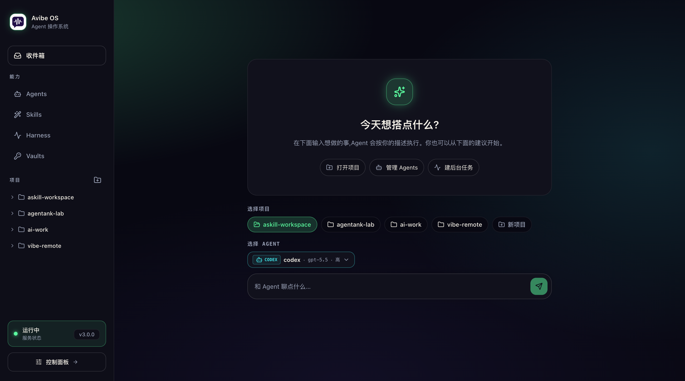
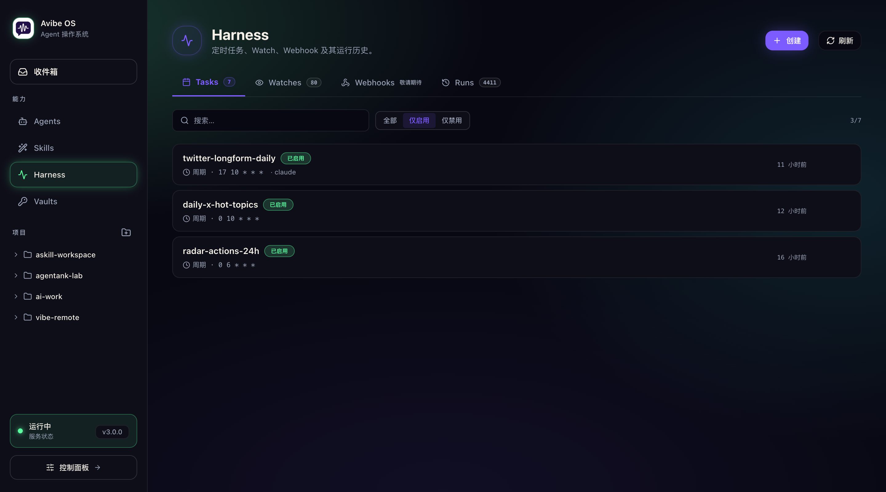
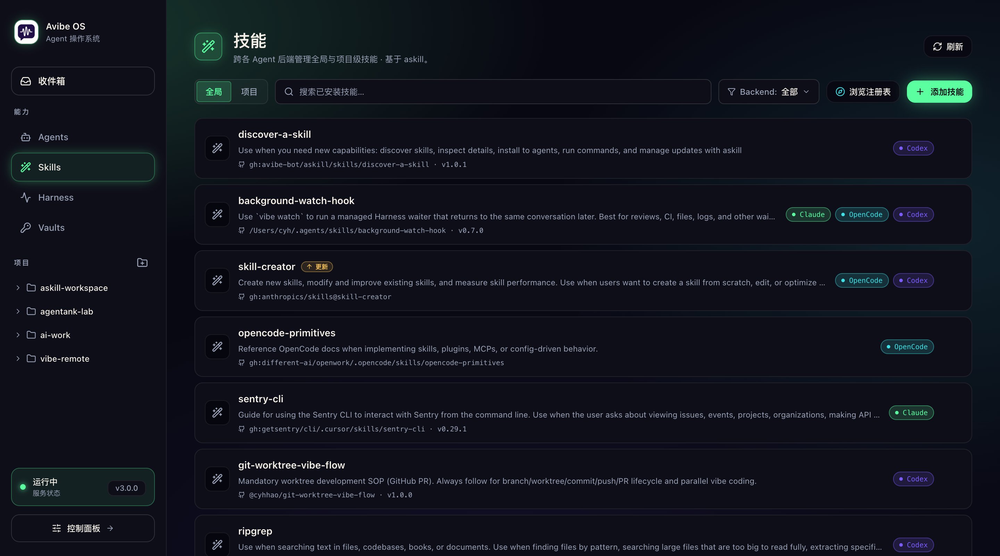
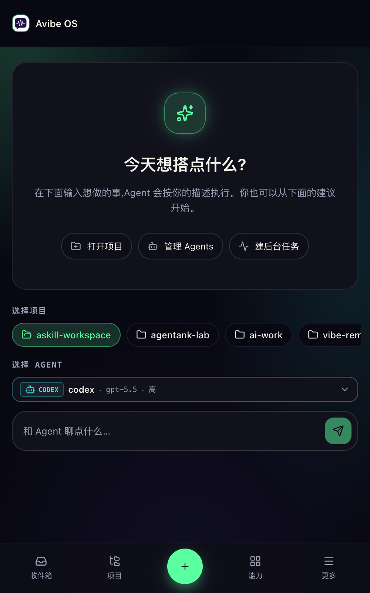

<div align="center">


# Avibe

### Avibe 是本地优先的 Agent OS——你的 AI 伙伴，住在你自己的机器上。

**拥有你的 agent。随处都能找到它。永不被锁死。**

[](https://github.com/avibe-bot/avibe/stargazers)
[](https://www.python.org/)
[](LICENSE)

<a href="https://www.producthunt.com/products/vibe-remote?embed=true&utm_source=badge-featured&utm_medium=badge&utm_campaign=badge-vibe-remote" target="_blank" rel="noopener noreferrer"></a>

[文档](https://docs.avibe.bot) · [English](README.md) · [中文](README_ZH.md)

**驱动**   
&nbsp;·&nbsp; **从这些地方找到它**      

</div>

<br/>



---

## 你的编程 agent 很强——但被困住了

Claude Code、Codex、OpenCode 都很能打。但是：

- 🖥️ **困在一台机器上。** 它活在终端里，合上笔记本它就停了。
- 📵 **够不着。** 离开工位，你连它在干什么都看不到，更别说指挥。
- 🔒 **被锁死。** 每个工具都想当整个栈：它的 app、它的云、它的订阅，你的代码还得传到别人的盒子里。

## Avibe 把这件事反过来

**一条命令，把你自己的机器变成 AI 伙伴的家。** 你驱动的是*官方*的 Claude Code、Codex、OpenCode——从浏览器或任意聊天软件——而代码、密钥、数据从不离开家。

```bash
curl -fsSL https://avibe.bot/install.sh | bash && vibe
```

浏览器自动打开，跟着简短向导走完，你的机器就成了一个随处可达的 Agent OS。

> 开源——想看可以先读一遍[安装脚本](https://github.com/avibe-bot/avibe/blob/master/install.sh)。短链只是到这个文件的 307 重定向。

<details>
<summary><b>用 Windows？</b></summary>

Windows 上推荐用 WSL，兼容性最好——见 [从零用 WSL 跑 Avibe](docs/WINDOWS_WSL.md)。里面讲清楚 WSL 装在哪、用哪个终端、在哪运行安装命令、怎么打开 Web UI。
</details>

> 💚 **Avibe 是用 Avibe 自己做出来的。** 这个项目从头到尾都是我用 Avibe 开发的——从浏览器、从手机指挥 Claude Code、Codex、OpenCode，在不在电脑前都能无缝衔接。越往后做越快，体验和效率直接拉爆。—— [@alex_metacraft](https://x.com/alex_metacraft)

---

## 你能得到什么

### 💬 一个跟着你走的 Workbench

直接在浏览器里和 agent 对话——也可以把 Workbench 装成桌面或手机 app，有活儿需要你时直接推送通知。同一个 agent、同一批会话，在工位上还是在路上都一样。

### 🧠 它有自己的时间线——Agent Harness

大多数 AI 工具只在你打字时才动。Avibe 给 agent 几个持久化基础能力——**运行、定时、监听、查历史**——让它能发起工作、等到合适的时机、后台跑完回来汇报。用人话说，它在背后自己组合命令。



### 🧩 技能，跨所有 agent 通用

可复用的技能——你的约定、你的工作流——在一个地方管理，Claude Code、Codex、OpenCode 通用。配置一次，你跑的每个 agent 都继承。



### 📱 装进口袋



机器在干活，你不用守着它。运行 `vibe remote`，本地 Workbench 通过安全的 `avibe.bot` 隧道，从地球上任意浏览器都能打开——不用 VPN、不用端口转发、不用把公网 webhook 指向你的笔记本。

你在飞机上、在咖啡馆、用着借来的电脑。agent 提示有个活儿需要你。点开链接，指挥两句，再走开。

- 🌍 **你自己的 `you-app.avibe.bot`**——30 秒登录，slug 跟你一辈子
- 🔒 **每道关卡默认拒绝**——鉴权、路由、host 校验都是 fail-closed
- 📱 **移动端友好**——为借来的小屏设计

**数据面留在你的机器上**；`avibe.bot` 只负责控制面的握手。

<br clear="all"/>

---

## Avibe 凭什么不同

| | |
|---|---|
| **本地优先，且属于你** | AI 伙伴、它的执行、你的密钥和数据，都留在你的机器上。`avibe.bot` 只签发身份和一条安全隧道，从不中转你的数据。 |
| **一套底座，通吃所有第一方 agent** | 驱动*官方*的 Claude Code、Codex、OpenCode。自带订阅或 key，按任务切换，不被任何一家的 silo 绑死。 |
| **浏览器和聊天，都是一等入口** | 用浏览器 Workbench，或 Slack、Discord、Telegram、微信、飞书。同一个 agent，同一批会话。 |
| **没有中间人** | 你和 agent 之间没有第二层推理。token 直接花在你选的 agent 上。 |

coding 只是第一个强场景，不是产品边界。

---

## 它怎么工作

```
┌──────────────┐            ┌──────────────┐            ┌──────────────┐
│     你         │   浏览器    │              │   stdio    │  Claude Code  │
│  （任意地点）   │   Slack    │    Avibe      │ ─────────▶ │  OpenCode     │
│               │  Discord   │ （你的机器）   │ ◀───────── │  Codex        │
│               │  Telegram  │              │            │               │
│               │   微信      │              │            │               │
│               │   飞书      │              │            │               │
└──────────────┘            └──────────────┘            └──────────────┘
```

1. **你说一句**——在浏览器或聊天软件里：*“给设置页加个深色模式。”*
2. **Avibe 路由**到你配置的 agent，落在正确的项目里。
3. **agent** 读你本地的代码、写代码、把结果流式发回来。
4. **你审阅**，在同一个界面里迭代，之后随时随地接着干。

**你的数据从不离开机器。** Avibe 在本地运行，通过 Slack Socket Mode、Discord Gateway、Telegram 长轮询、微信轮询或飞书 WebSocket 向外连接——正常聊天控制不需要任何公网入站端口。

---

## Avibe vs OpenClaw

| | Avibe | OpenClaw |
|---|---|---|
| **设置** | 一条命令 + Web 向导，几分钟搞定。 | Gateway + channels + JSON 配置，准备搭一下午。 |
| **安全** | 本地优先，只走 Socket Mode / WebSocket。没有公网入站端口，攻击面小。 | Gateway 暴露端口，组件更多、面更大。 |
| **Token 开销** | 中间没有额外推理 loop，token 直接花在你选的 agent 上。 | 每条消息都背着一长串人设/编排上下文，活儿还没开始 token 先烧。 |
| **锁定** | 驱动官方 agent CLI，自带 key，按任务切换。 | 绑在它自己的助手循环上。 |

OpenClaw 是个 always-on 的个人助手——闲聊很好，干真活儿就贵。Avibe 是给你已经信任的那些 agent 用的**本地优先 Agent OS**：agent 还是它自己，数据留在本地，同事感来自把 agent 放进你本来就在用的工作流里。

---

## 像同事一样跟它说话

用人话说，Harness 在背后自己组合命令：

- *“盯着这个 PR，有 actionable review 再回来处理。”*
- *“每个工作日上午跑一遍部署检查，把摘要发到这里。”*
- *“为这个 incident 新开一个调查会话，但把结论发回这个频道。”*
- *“CI 挂了就总结日志；过了就告诉我这个 PR 能不能合。”*

**对话中途换 agent**——加个前缀就行：

```
Plan: 给 API 设计一个新的缓存层
```

**按项目路由**——不同的活儿，不同的 agent：

```
frontend   → OpenCode    （快速迭代）
backend    → Claude Code  （复杂逻辑）
prototypes → Codex        （快速试验）
```

---

## 认识云团子（Vibey）

<div align="center">

</div>

住在你的 Workbench 和聊天软件里。读得懂气氛，会接你昨天没做完的活儿。不确定就先问一句，你专注的时候它不打扰，凌晨两点灵感来了就动手，第二天给你留张便条，说改了哪儿。

> Avibe 是 agent 住的那个家，云团子是住在里面的那位同事。

什么都记得，有自己的脾气。你修了它的 bug，它会道谢。

---

## 命令

```bash
vibe            # 启动 Avibe 并打开 Workbench
vibe status     # 查看服务和配置状态
vibe stop       # 停止本地服务
vibe doctor     # 诊断常见安装问题
vibe remote     # 通过 avibe.bot 从任意设备访问 Workbench
vibe agent      # 运行和管理 Avibe agent
vibe task       # 安排定时工作（cron / 一次性）
vibe watch      # 等一个条件成立，然后行动
vibe runs       # 查看 agent 运行历史
```

| 在聊天里 | 作用 |
|---|---|
| @ 一下 bot | 开一个任务或提问 |
| 在 thread 里回复 | 继续同一个 agent 会话 |
| `/stop` | 停止当前会话 |

完整参考：[命令](docs/COMMANDS.md) · [CLI](docs/CLI.md)

---

## 前置条件

至少装一个编程 agent：

<details>
<summary><b>OpenCode</b>（推荐）</summary>

```bash
curl -fsSL https://opencode.ai/install | bash
```

在 `~/.config/opencode/opencode.json` 里加上这一段，跳过权限弹窗：

```json
{ "permission": "allow" }
```
</details>

<details>
<summary><b>Claude Code</b></summary>

```bash
npm install -g @anthropic-ai/claude-code
```
</details>

<details>
<summary><b>Codex</b></summary>

```bash
npm install -g @openai/codex
```
</details>

---

## 安全

- **本地优先**——Avibe 跑在你的机器上，代码和 agent 进程都留在本地。
- **没有公网入站端口**——聊天控制只走 Socket Mode / WebSocket / 长轮询。
- **你的 key、你的数据**——存在 `~/.avibe/` 下，只发给你选的 AI 提供商。老安装保留 `~/.vibe_remote/` 作为兼容路径。
- **远程访问默认拒绝**——`avibe.bot` 只代理身份和隧道，从不碰你的数据。

---

## 卸载

```bash
vibe stop
uv tool uninstall avibe-os
uv tool uninstall vibe-remote   # 旧版安装
rm -rf ~/.avibe ~/.vibe_remote
```

---

## 文档

- **[官方文档](https://docs.avibe.bot)**——快速上手、概念、平台与 agent 指南、排障
- **[Avibe 是什么](https://docs.avibe.bot/zh/concepts/agent-os)**——Agent OS 模型
- **[CLI 参考](docs/CLI.md)** · **[命令](docs/COMMANDS.md)**
- **[让 AI agent 帮你装](docs/INSTALL_FOR_AI.md)**——把它丢给 Claude Code、Codex 或 OpenCode，引导式安装
- **[Slack](docs/SLACK_SETUP.md)** · **[Discord](docs/DISCORD_SETUP.md)** · **[Telegram](docs/TELEGRAM_SETUP.md)** 设置指南

---

<div align="center">

**拥有你的 agent。随处都能找到它。**

[立即安装](#avibe-把这件事反过来) · [文档](https://docs.avibe.bot) · [报 bug](https://github.com/avibe-bot/avibe/issues) · [关注 @alex_metacraft](https://x.com/alex_metacraft)

</div>
