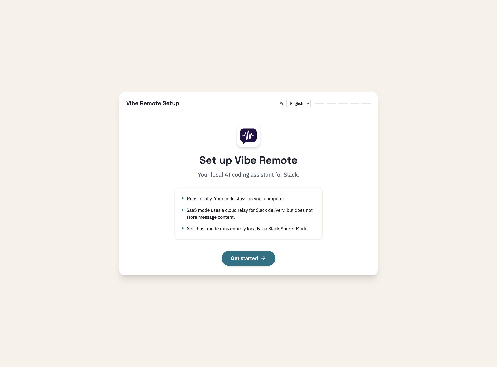
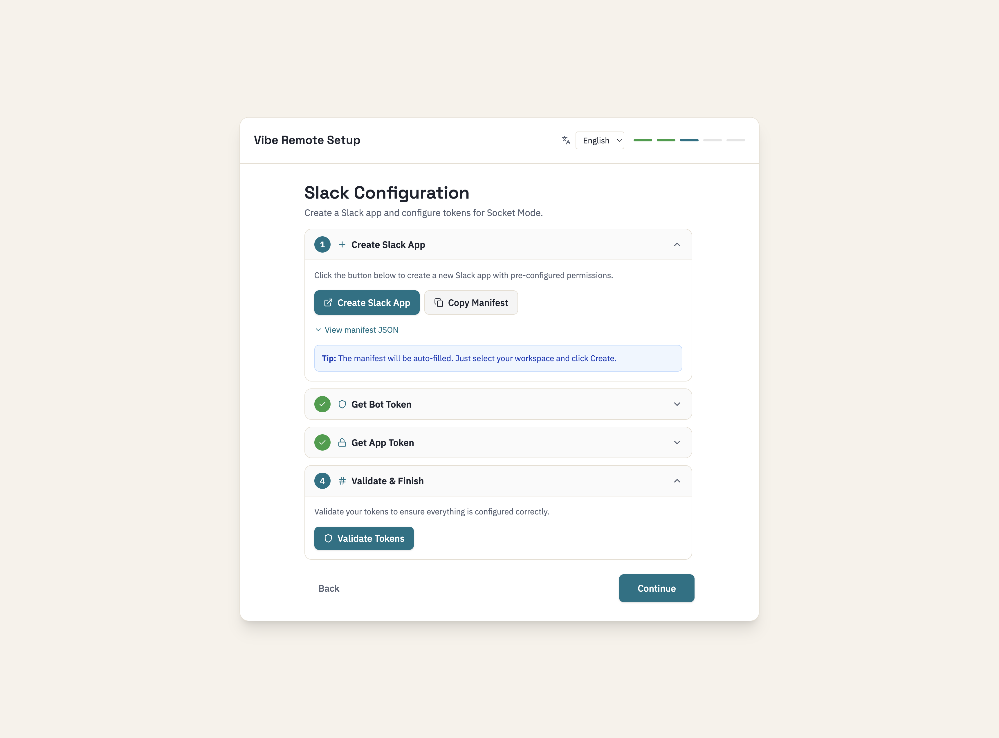
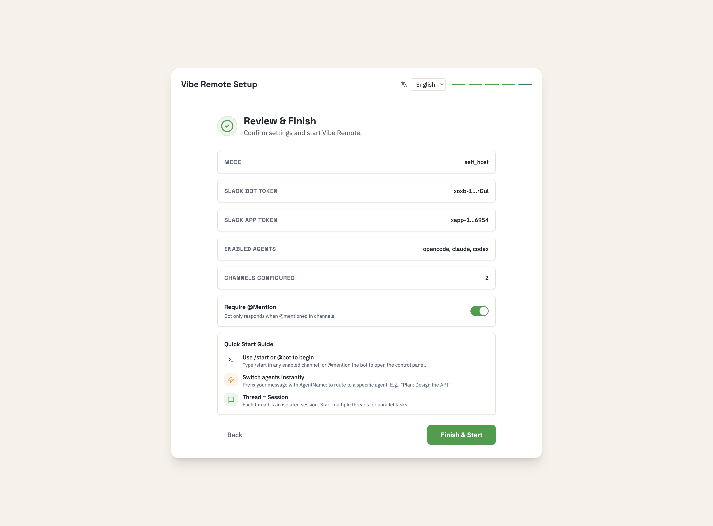
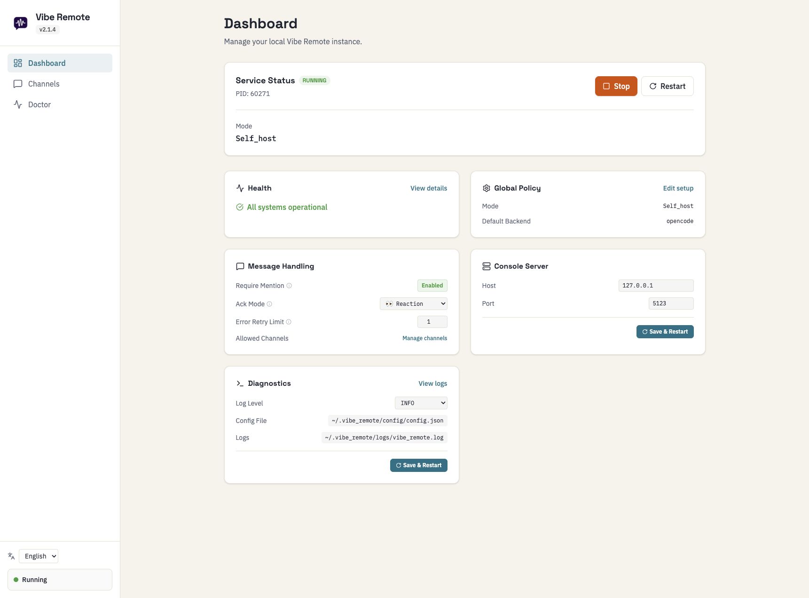

# Slack Setup (5 minutes)

## TL;DR

1. Run `vibe` → Browser opens the setup wizard
2. Follow the wizard to create Slack App and get tokens
3. Done!

---

## Step 1: Launch Setup Wizard

```bash
vibe
```

Your browser opens automatically to the setup wizard:



Click **Get started** to begin.

---

## Step 2: Create Slack App

The wizard guides you through creating a Slack App with pre-configured permissions:



1. Click **Create Slack App** — opens Slack with manifest pre-filled
2. Select your workspace and click **Create**
3. Follow the steps to get your **Bot Token** (`xoxb-`) and **App Token** (`xapp-`)
4. Paste them in the wizard and click **Validate**

<details>
<summary><b>Manual Setup (if needed)</b></summary>

Go to [api.slack.com/apps](https://api.slack.com/apps) and create app with this manifest:

```yaml
display_information:
  name: Vibe Remote
  description: AI coding agent for Slack
  background_color: "#0B1B2B"
features:
  bot_user:
    display_name: Vibe Remote
    always_online: false
  slash_commands:
    - command: /start
      description: Open main menu
      should_escape: false
    - command: /stop
      description: Stop current session
      should_escape: false
oauth_config:
  scopes:
    bot:
      - channels:history
      - channels:read
      - chat:write
      - chat:write.public
      - app_mentions:read
      - users:read
      - commands
      - groups:read
      - groups:history
      - groups:write
      - files:read
      - files:write
      - reactions:read
      - reactions:write
      - users:read.email
      - team:read
settings:
  event_subscriptions:
    bot_events:
      - message.channels
      - message.groups
      - app_mention
      - member_joined_channel
      - member_left_channel
      - channel_created
      - channel_renamed
      - team_join
  socket_mode_enabled: true
  interactivity:
    is_enabled: true
```
</details>

---

## Step 3: Finish & Start

Review your settings and click **Finish & Start**:



The wizard shows you quick tips on how to use Vibe Remote.

---

## Step 4: Dashboard

Once setup is complete, you'll see the Dashboard:



From here you can:
- Start/stop the service
- Configure message handling options
- Manage channel settings
- View logs and diagnostics

---

## Step 5: Use in Slack

1. Invite bot to channel: `/invite @Vibe Remote`
2. Type `/start` or `@Vibe Remote`
3. Start coding!

---

## Troubleshooting

| Problem | Fix |
|---------|-----|
| Bot not responding | Check `vibe status`, ensure bot is invited |
| Permission error | Reinstall app to workspace |
| Socket error | Verify `xapp-` token has `connections:write` |

Logs: `~/.vibe_remote/logs/vibe_remote.log`

Diagnostics: `vibe doctor`
