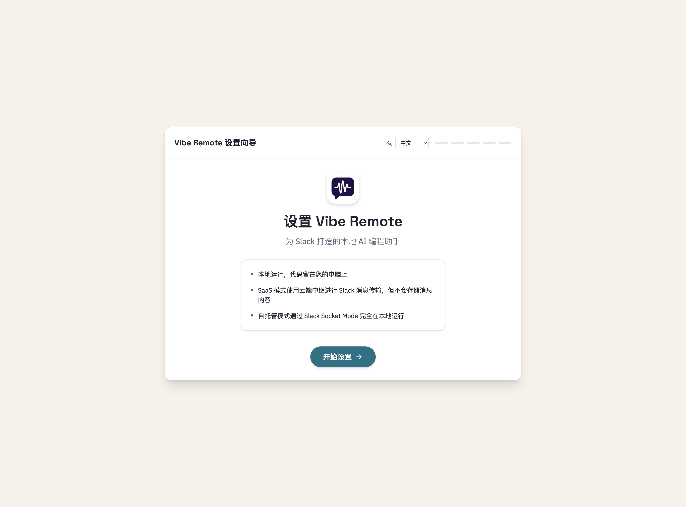
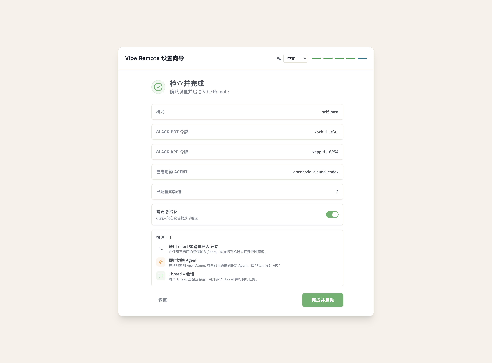

# Slack 配置指南

## 太长不看

```bash
vibe
```

浏览器打开 -> 跟着向导走 -> 完事！

---

## 第 1 步：欢迎页面

运行 `vibe` 启动设置向导，浏览器会自动打开：



点击 **开始设置** 开始。

---

## 第 2 步：Slack 配置

向导会引导你创建 Slack App：


1. 点击 **创建 Slack 应用** — 打开 Slack 并自动填充配置
2. 选择你的工作区，点击 **Create**
3. 按照折叠步骤获取 **Bot Token**（`xoxb-`）和 **App Token**（`xapp-`）
4. 点击 **验证令牌** 确认配置

<details>
<summary><b>手动配置（如需要）</b></summary>

打开 [api.slack.com/apps](https://api.slack.com/apps)，用以下 manifest 创建 App：

```json
{
  "_metadata": {
    "major_version": 1,
    "minor_version": 1
  },
  "display_information": {
    "name": "Vibe Remote",
    "description": "AI coding agent runtime for Slack",
    "background_color": "#262626"
  },
  "features": {
    "bot_user": {
      "display_name": "Vibe Remote",
      "always_online": true
    },
    "app_home": {
      "home_tab_enabled": true,
      "messages_tab_enabled": true,
      "messages_tab_read_only_enabled": false
    }
  },
  "oauth_config": {
    "scopes": {
      "bot": [
        "channels:history",
        "channels:read",
        "chat:write",
        "app_mentions:read",
        "users:read",
        "commands",
        "groups:read",
        "groups:history",
        "im:history",
        "im:read",
        "im:write",
        "mpim:history",
        "mpim:read",
        "mpim:write",
        "files:read",
        "files:write",
        "reactions:read",
        "reactions:write"
      ]
    }
  },
  "settings": {
    "event_subscriptions": {
      "bot_events": [
        "message.channels",
        "message.groups",
        "message.im",
        "message.mpim",
        "app_mention",
        "reaction_added",
        "reaction_removed"
      ]
    },
    "interactivity": {
      "is_enabled": true
    },
    "org_deploy_enabled": true,
    "socket_mode_enabled": true,
    "token_rotation_enabled": false
  }
}
```
</details>

---

## 第 3 步：检查并完成

确认配置，点击 **完成并启动**：



向导会显示快速上手提示。

---

## 第 4 步：仪表盘

设置完成后，你会看到仪表盘：


在这里你可以：
- 启动/停止服务
- 配置消息处理选项
- 管理频道设置

---

## 在 Slack 中使用

1. 邀请 bot 到频道：`/invite @Vibe Remote`
2. 输入 `/start` 或 `@Vibe Remote` 打开控制面板
3. 开始写代码！

**技巧：**
- 每个 Slack 线程 = 独立会话
- 开多个线程可以并行任务
- 用 `AgentName: 消息` 路由到指定 Agent

---

## 故障排除

| 问题 | 解决 |
|------|------|
| Bot 不响应 | 检查 `vibe status`，确认 bot 已被邀请到频道 |
| 权限错误 | 重新安装 App 到工作区 |
| Socket 错误 | 确认 `xapp-` token 有 `connections:write` 权限 |

**日志：** `~/.vibe_remote/logs/vibe_remote.log`

**诊断：** `vibe doctor`
